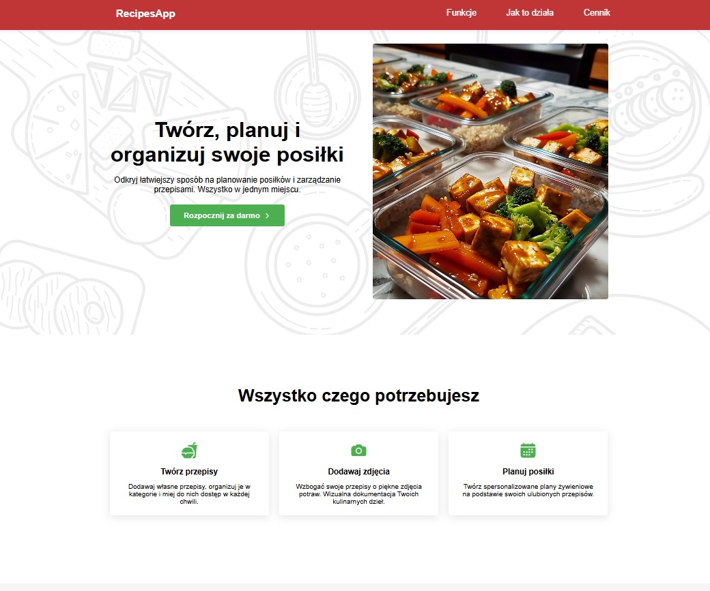

# 🍽️ Meal Planner App

Aplikacja do zarządzania przepisami i tworzenia planów posiłków. Pozwala na dodawanie prywatnych oraz publicznych przepisów, układanie planów na wybrane dni oraz łatwe wyszukiwanie i organizowanie potraw.

---

## ▶️ Demo

Odwiedź (https://linka351.github.io/RecipesApp/)

---

## 🚀 Funkcje

- ✅ Dodawanie, edytowanie i usuwanie przepisów
- ✅ Tworzenie planów posiłków z listą przepisów na podstawie których można dostosować swoją dietę do swoich potrzeb i celów.
- ✅ Obsługa przepisów prywatnych i publicznych
- ✅ Przeglądanie i filtrowanie listy planów
- ✅ Autoryzacja użytkowników (Firebase Auth)
- ✅ System uprawnień (admin, dodaje przepisy publiczne, user dodaje przepisy prywatne)
- ✅ Zapis danych w chmurze (Firebase Firestore)

---

## 🛠️ Technologie

- **React** + **TypeScript**
- **SCSS**
- **Formik**
- **Yup**
- **Firebase** (Firestore + Auth + Storage)
- **React Router**
- **React Toastify**
- **React Icons**

---

## 📸 Zrzuty ekranu

### Strona powitalna



### Lista planów


### Lista przepisów


### Dodawanie nowego przepisu


---

## ▶️ Jak uruchomić projekt lokalnie

1. **Sklonuj repozytorium:**

   ```bash
   git clone https://github.com/twoja-nazwa-uzytkownika/meal-planner.git
   cd meal-planner
   ```

2. **Zainstaluj zależności:**

   ```bash
   npm install
   ```

3. **Skonfiguruj Firebase:**

   Utwórz plik `.env.local` z poniższą zawartością:

   ```env
   VITE_FIREBASE_API_KEY=...
   VITE_FIREBASE_AUTH_DOMAIN=...
   VITE_FIREBASE_PROJECT_ID=...
   VITE_FIREBASE_STORAGE_BUCKET=...
   VITE_FIREBASE_MESSAGING_SENDER_ID=...
   VITE_FIREBASE_APP_ID=...
   ```

4. **Uruchom aplikację:**
   ```bash
   npm run dev
   ```

---

## 📁 Struktura projektu

```
src/
│
├── components/        // Reużywalne komponenty UI
├── features/          // Główne funkcjonalności (przepisy, plany, auth)
├── pages/             // Widoki stron
├── styles/            // SCSS globalne i zmienne
├── firebase/          // Konfiguracja Firebase
├── utils/             // Funkcje pomocnicze
└── App.tsx            // Główna konfiguracja routingu
```

---

## ✍️ Autor

- Imię i nazwisko: Kamil Linka
- GitHub: https://github.com/linka351

---
